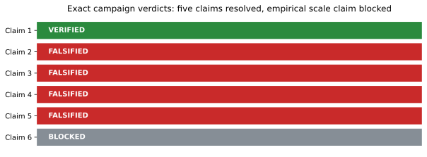
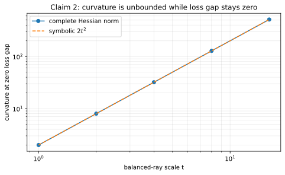
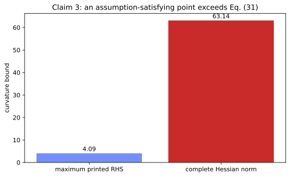
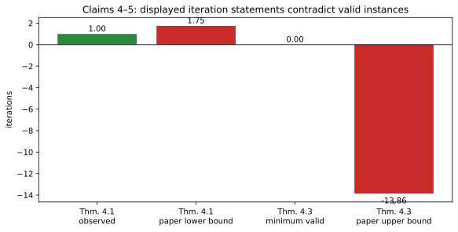
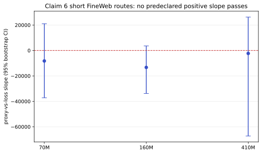

# Why warm-up? An exact claim audit



- Previous live judged score: `5/12`
- Conservative projected score range after publication: `5–10/12`
- Best-supported possible new score: `10/12` — forecast only, not a judge result

The paper asks why neural-network training often begins with a deliberately
small learning rate. Its theory proposes a curvature model,

`||∇²f(w)|| ≤ H0 + H1 (f(w) − f*)`,

then argues that an adaptive step size based on this bound provides automatic
warm-up and faster convergence. The earlier reproduction checked small
numerical examples. This campaign instead audited the exact quantified
statements, reconstructed their assumptions, and required each verifier to fail
closed.

## What was implemented

One pinned Python 3.12 environment and one fixed command were used on every
experiment node:

```text
uv run --frozen python -m warmup_repro.run
```

The implementation path is intentionally direct:

1. `warmup_repro/run.py` reads the committed stage.
2. The cumulative verifier calls the symbolic definition certificate.
3. Complete autograd Hessians are checked against analytic or high-precision
   reconstructions.
4. Every counterexample audits the paper assumptions before evaluating the
   claimed inequality.
5. A control removes the intended counterexample mechanism and must no longer
   contradict the claim.

Claim 6 uses separate committed CPU routes because its models and data are much
larger. Those routes never upgrade a short or substituted trajectory into a
paper-scale result.

## Exact theoretical results

| Claim | Paper statement tested | Observed evidence | Verdict |
|---|---|---|---|
| 1 | Definition 3.1 and smooth-class inclusion | Algebraic certificate; 48D HVP/full-Hessian error `8.95e-11` | VERIFIED |
| 2 | Proposition 3.2(ii), all strongly balanced weights | Zero loss gap with Hessian norm `2t²`, unbounded as `t→∞` | FALSIFIED |
| 3 | Proposition 3.3(ii), printed Eq. (31) constants | Hessian `63.1359` exceeds the maximum valid printed RHS `4.0883` | FALSIFIED |
| 4 | Theorem 4.1(3) under its Eq. (63) step cap | One GD step reaches the minimum although the claimed lower bound is `1.7463` | FALSIFIED |
| 5 | Theorem 4.3 displayed iteration formula | A valid PL instance produces the impossible upper bound `−13.8629` iterations | FALSIFIED |
| 6 | Section 3.2 named models and paper-scale early training | Exact parameter scales were attempted, but horizon and batch substitutions remain material | BLOCKED |

### Claim 1: the definition is exact, one closure constant is not

Ordinary `L`-smoothness is exactly the `H1=0, H0=L` special case. The
independently reconstructed inclusion certificate has zero symbolic residual,
and a 48-dimensional full Hessian agrees with Hessian-vector power iteration to
relative error `8.95e-11`.

The negative control catches a separate defect: Proposition B.2's printed
finite-sum constants can give `H0=-100` for a zero-Hessian function. Closure is
not lost; its constant needs the shift-invariant correction recorded in the raw
evidence.

### Claim 2: balancedness does not control an unobserved subspace



Take `X=diag(1,0)`, `Y=0`, and `W1=W2=diag(0,t)`. Every tested point has exact
strong-balance residual zero and loss `f=f*=0`, but a complete `8×8` Hessian has
spectral radius `2t²`. The proposition would require `2t²≤H0` for every `t`,
which no finite `H0` can satisfy. Replacing `X` by the identity is the negative
control: the same ray then has loss `t⁴`, so the mechanism disappears.

This falsifies the proposition as written because it does not require
full-row-rank data. It does not falsify a rank-restored theorem.

### Claim 3: the published constant drops an `f*` term



The one-hidden-unit CE+L2 counterexample uses the globally smooth activation
`φ(s)=s+(a/ω)sin(ωs)`. Its bounds `C1=C2=1.0001`,
`C3=423.8903`, and positive regularizers satisfy every printed assumption.
At the audited point, an exact lower bound on `f*` makes `4.0883` the largest
possible right-hand side under Eq. (31), while the complete Hessian norm is
`63.1359`. Autograd, a closed-form eigensystem, and an 80-digit calculation
agree within `2.14e-14`.

Setting `a=0` is the control and no longer contradicts the bound. The scope is
the printed constants: the reconstructed derivation shows that adding the
omitted `Clinear·f*` term repairs this specific defect.

### Claims 4–5: the displayed iteration bounds cross valid hitting times



For Claim 4, the counterexample is the paper's own `C²`,
strongly-convex/PL construction: quadratic on `|w|≤1` and exponential outside.
Value, gradient, and Hessian match at the boundary; `H0=2`, `H1=1`, and `μ=2`
are certified. An Eq. (63)-admissible fixed step reaches zero in one iteration,
but Theorem 4.1(3) claims at least `1.7463`. Appendix J uses
`−log(1−z)≥z` in the direction that enlarges a necessary lower bound. A looser
target is non-contradictory, as intended. The adaptive Theorem 4.2 upper bound
is not contradicted.

For Claim 5, `f(w)=w²/2` satisfies the stated PL and curvature assumptions. At
the minimizer with `ε=1`, the displayed Theorem 4.3 expression is `−13.8629`;
no nonnegative hitting time can be at most that value. The small-`ε` control
reaches its target in 77 iterations beneath the positive paper bound `302.45`.
The defect is the missing domain guard, not the corrected small-error
recurrence.

## Claim 6: full parameter counts are not full reproduction



The FineWeb route instantiated exact parameter counts:

| Model | Parameters | Slope | 95% bootstrap CI | Permutation p |
|---|---:|---:|---:|---:|
| 70M | 71,941,888 | −8,248 | [−37,178, 21,008] | 0.531 |
| 160M | 162,186,240 | −13,311 | [−33,825, 3,619] | 0.190 |
| 410M | 411,309,056 | −2,310 | [−67,275, 26,306] | 0.922 |

None passes the predeclared positive-slope test. That result is not a
falsification: 12 updates, micro-batch 1, sequence length 16, hashed tokens, and
float32 CPU differ materially from the paper's batch-256, long-sequence,
billion-token FP16 training.

A separate complete-Hessian calibration found that changing-minibatch noise was
18,284 times the curvature change at the median step. The printed stochastic
proxy ranged from 2,832 to 28,490 while the exact Hessian norm was about 0.603.
The cited primary estimator instead evaluates gradients on the same data along
an interpolation path. This is a serious measurement diagnostic, but it is not
a named-model falsification.

Four materially different routes were pursued:

1. exact-parameter FineWeb language models;
2. ResNet50 and ViT-Tiny on official ImageNet32 data;
3. a complete-Hessian estimator calibration with same-batch controls;
4. a literal implementation of the printed two-iterate/two-minibatch estimator.

The vision route completed three 30-step trajectories per model on official
ImageNet32 bytes. ResNet50's pooled slope was `−190,901` (95% CI
`[−448,990, 110,872]`, permutation `p=0.248`); ViT-Tiny's was `14,391`
(`[−21,559, 49,189]`, `p=0.455`). Neither predeclared test passed. The provider
reported a timeout after the complete verifier payload printed; its scientific
runtime was `23,837.27 s` on 64 CPUs. This remains non-dispositive because it
uses only 30 steps per seed, batch eight, float32, and one official training
member.

The fourth route was blocked before execution by two HF CPU image failures
(`uv` missing). Claim 6 therefore remains honestly `BLOCKED`.

## Confidence and score forecast

| Claim | Current points | Possible points | Confidence | Evidence status | Basis and remaining risk |
|---|---:|---:|---|---|---|
| 1 | 1 | 2 | HIGH | VERIFIED | Exact definition/inclusion proof; judge may scope the imported claim differently |
| 2 | 1 | 2 | HIGH | FALSIFIED | Stated assumptions hold; omitted rank condition is the main interpretation risk |
| 3 | 1 | 2 | HIGH | FALSIFIED | Three independent Hessian calculations; scope is printed Eq. (31) constants |
| 4 | 1 | 2 | HIGH | FALSIFIED | Class-stable counterexample satisfies the paper's own cap; Theorem 4.2 remains intact |
| 5 | 1 | 2 | MEDIUM | FALSIFIED | Displayed formula is impossible, but a reviewer may infer an unstated epsilon guard |
| 6 | 0 | 0 | LOW | BLOCKED | Paper-scale horizon, batch, tokenizer, precision, and literal-estimator execution remain unavailable |

Current live total: `5/12`. Conservative projected total after publication:
`5–10/12`. Best-supported possible total: `10/12`, strictly a forecast until
the live evaluator judges the published revision.

Claims 1–5 changed from toy evidence to exact verification or falsification.
Claim 6 remains blocked. A full empirical reproduction still needs the paper's
measurement implementation and tokenizer plus billion-token LM training and
complete ImageNet32 schedules on suitable hardware.

## Reproduction and provenance

- Fixed command: `uv run --frozen python -m warmup_repro.run`
- Python: `>=3.12,<3.13`, resolved by `uv.lock`
- Deterministic seed: `20260729`
- Short exact-theorem cumulative verifier: one local CPU thread
- FineWeb route: HF `cpu-upgrade`, 64 visible/selected threads, `4530.31 s`
- ImageNet32 route: HF `cpu-upgrade`, 64 visible/selected threads,
  `23837.27 s`; complete payload preceded provider timeout
- Paper source hashes and exact anchors: `.openresearch/artifacts/*/source_audit.md`
- Machine-readable results: `evidence/`

Important experiment lineage:

- [Exact theorem counterexamples](https://github.com/MachineLearning-Nerd/icml26-why-do-we-need-warm-up/tree/audit/c2-c5-exact-counterexamples)
- [Exact Proposition 3.3 counterexample](https://github.com/MachineLearning-Nerd/icml26-why-do-we-need-warm-up/tree/audit/c3-proposition33-counterexample)
- [Class-stable Theorem 4.1 counterexample](https://github.com/MachineLearning-Nerd/icml26-why-do-we-need-warm-up/tree/audit/c4-class-stable-counterexample)
- [Exact-scale FineWeb route](https://github.com/MachineLearning-Nerd/icml26-why-do-we-need-warm-up/tree/audit/c6-fineweb-lm-curvature)
- [Exact ImageNet32 route](https://github.com/MachineLearning-Nerd/icml26-why-do-we-need-warm-up/tree/audit/c6-imagenet32-curvature)

No toy result is described as full-scale, and `BLOCKED` is not converted into a
pass.
